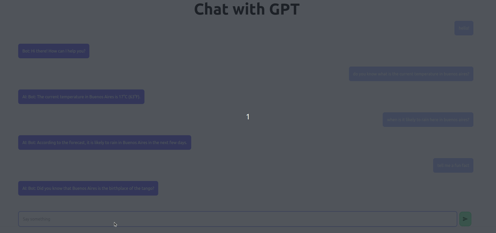

# GPT Client done with Next.js + Tailwind CSS

This is a chat client wired to consume OpenAI Chat GPT3 API, preserving the chat history so that the model holds a conversation with the user

### Run Chat GPT

1. Install dependencies
```
$ npm i
```

2. Create a file like `.env.local` containing your OpenAI credentials:
Eg:
```
OPENAI_ORG=<your-org-id>
OPENAI_KEY=<your-key>
```

3. Then simply run `npm run dev`

## Demo

